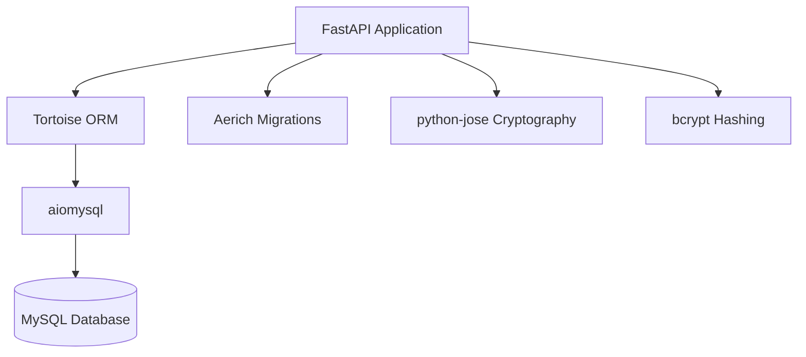

# Documentação Arquitetural: Microsserviço de Autenticação (`authentication`)

Este documento serve como referência técnica detalhada sobre a arquitetura, pilha tecnológica, modelos de base de dados, regras de negócio e fluxos de segurança do microsserviço de autenticação (`authentication`).

---

## 1. Visão Geral e Responsabilidades
O microsserviço `authentication` é o núcleo centralizado de identidade da plataforma. As suas responsabilidades principais incluem:
* **Autenticação:** Login com suporte para palavra-passe convencional ou OTP (One-Time Password) via e-mail.
* **Geração de Tokens (Identity Provider):** Emissão de tokens JWT assimetricamente assinados usando chaves privadas RSA (RS256).
* **Gestão de RBAC (Role-Based Access Control):** Controlo fino de acesso através da associação de utilizadores a perfis (*roles*), que por sua vez contêm permissões granulares (`slugs`) e definição de janelas acessíveis (`AppWindows`).
* **Estrutura Organizacional:** Gestão centralizada de Empresas e uma estrutura hierárquica dinâmica baseada em Unidades Organizacionais (`OrgUnit`) e Tipos de Unidades (`OrgUnitType`).

---

## 2. Pilha Tecnológica (Tech Stack)



* **Core Engine:** FastAPI (assíncrono, validação automática com Pydantic).
* **ORM:** Tortoise ORM (assíncrono, modelado com inspiração no padrão do Django).
* **Driver de Base de Dados:** `aiomysql` (ligações não bloqueantes ao MySQL).
* **Migrações de BD:** Aerich.
* **Segurança Criptográfica:** `bcrypt` (para hashing de passwords) e `python-jose` (para assinatura e desencriptação de tokens JWT com criptografia assimétrica RSA RS256).

---

## 3. Estrutura de Diretórios e Componentes

O projeto adota uma arquitetura limpa com responsabilidades bem delimitadas:

```
authentication/
├── app/
│   ├── core/              # Configurações globais, leitura de variáveis de ambiente e segurança
│   ├── database/          # Modelos Tortoise, relações e repositórios
│   │   ├── models/        # Esquemas relacionais (User, Role, Permission, etc.)
│   │   └── repository/    # Lógica de persistência e transações encapsuladas
│   ├── schemas/           # Pydantic schemas para validação e serialização de APIs
│   ├── routers/           # Endpoints HTTP do FastAPI agrupados por domínio
│   ├── utils/             # Serviços auxiliares de e-mail e utilitários
│   ├── depedencies.py     # Injeção de dependências comuns (e.g. verify_internal_access)
│   └── main.py            # Inicialização, middlewares e registo do ORM
```

---

## 4. Esquema de Base de Dados (Modelos Tortoise)

O domínio da base de dados está focado em suportar uma estrutura robusta de perfis e acessos:

```mermaid
erDiagram
    USER ||--o[1] ORG_UNIT : "alocado em"
    ORG_UNIT ||--o[1] ORG_UNIT_TYPE : "é do tipo"
    ORG_UNIT }o--o[1] ORG_UNIT : "filho de"
    USER ||--o{ USER_COMPANY : "associado a"
    USER_COMPANY }o--|| COMPANY : "pertence a"
    USER ||--o{ USER_EMAIL : "possui"
    USER ||--o{ USER_CONTACT : "possui"
    USER ||--o{ USER_LOG : "gera logs"
    USER ||--o{ USER_APP_ACCESS : "autorizado em"
    USER_APP_ACCESS }o--|| APPLICATION : "refere a"
    
    ROLE }o--o{ PERMISSION : "contem"
    ROLE }o--o{ APP_WINDOW : "acede a"
    USER }o--o{ ROLE : "possui roles"
```

### Principais Entidades:
1. **`User` (Utilizador):**
   * Contém atributos de identidade (`first_name`, `last_name`, `employee_number`, `username`).
   * Guarda o hash seguro da palavra-passe (`hashed_password`) e flags de estado (`deactivated_at`, `deleted_at`).
   * Armazena segredos temporários para recuperação ou login simplificado de colaboradores (`recovery_secret`, `recovery_secret_expires_at`, `recovery_attempts`).
   * Possui cargo (`job_title`) e está associado a uma `OrgUnit`.
2. **Estrutura Organizacional (`OrgUnit` e `OrgUnitType`):**
   * Substituiu departamentos e locais estáticos. Permite construir uma árvore de hierarquia organizacional infinita com níveis definidos (ex: Empresa, Departamento, Secção).
3. **Gestão de Acesso Multi-App (`Application` e `UserApplicationAccess`):**
   * Centraliza a autorização a aplicações externas. O token JWT transporta os `slugs` das aplicações autorizadas para o utilizador.
4. **RBAC Interno (`Role`, `Permission`, `AppWindow`):**
   * Grupos de acesso e ações (`slugs`) usados **exclusivamente** para controlo de permissões internas dentro da interface do próprio microsserviço de autenticação.

---

## 5. Fluxos de Autenticação e Segurança

### 5.1. Fluxos de Login: Password vs OTP

A forma de autenticação depende se o utilizador tem uma palavra-passe configurada ou não:

* **Login com Palavra-passe:**
  * Para utilizadores que têm a sua conta configurada com uma palavra-passe (o fluxo mais restrito e convencional).
* **Login com PIN (OTP):**
  * Utilizado habitualmente por utilizadores que não configuraram palavra-passe (ex: utilizadores normais/colaboradores que apenas acedem ocasionalmente).
  * O fluxo inicia-se chamando `/auth/.validate-identifier`, que gera um OTP aleatório de 6 dígitos, encripta-o, envia-o ao e-mail do utilizador e define uma validade de 10 minutos com o máximo de 3 tentativas de validação incorretas.

### 5.2. JWKS e Segurança Criptográfica Assimétrica (RS256)
* O microsserviço assina os JWTs (`Access Token` e `Refresh Token`) recorrendo a uma **chave privada RSA** (`AUTH_PRIVATE_KEY`).
* O `Access Token` gerado transporta a lista de aplicações a que o utilizador tem acesso (`apps`) e dados da hierarquia (`org_unit_type`, `org_unit_id`) no próprio payload do token.
* O serviço expõe o endpoint público `/jwks.json` contendo as chaves públicas correspondentes. Qualquer outro microsserviço na plataforma pode descarregar e guardar em cache esta chave pública para decodificar e validar os tokens recebidos, eliminando a latência de efetuar chamadas adicionais de verificação ao serviço de autenticação.

---

## 6. Comunicação Interna e Gateways

Todas as rotas sob o prefixo `/api/v1` (administração de utilizadores, empresas, departamentos, etc.) exigem validação de acesso interno:
* O cabeçalho HTTP `X-Internal-Key` é confrontado com a chave configurada em `INTERNAL_API_KEY`.
* Garante que apenas chamadas provenientes do Gateway ou de outros microsserviços confiáveis na rede interna consigam invocar alterações no repositório de utilizadores.
